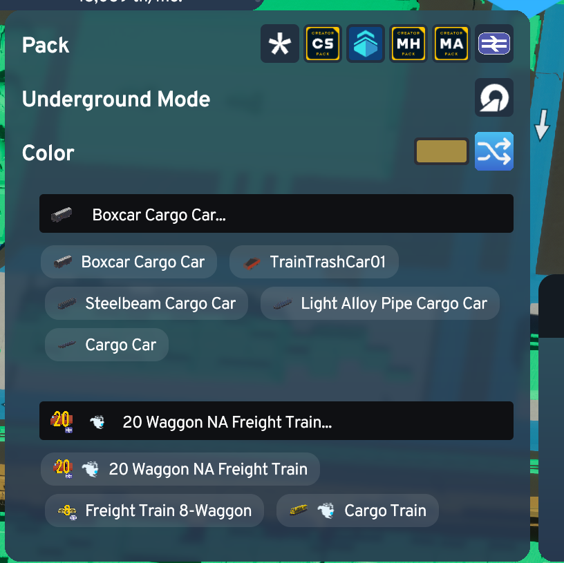
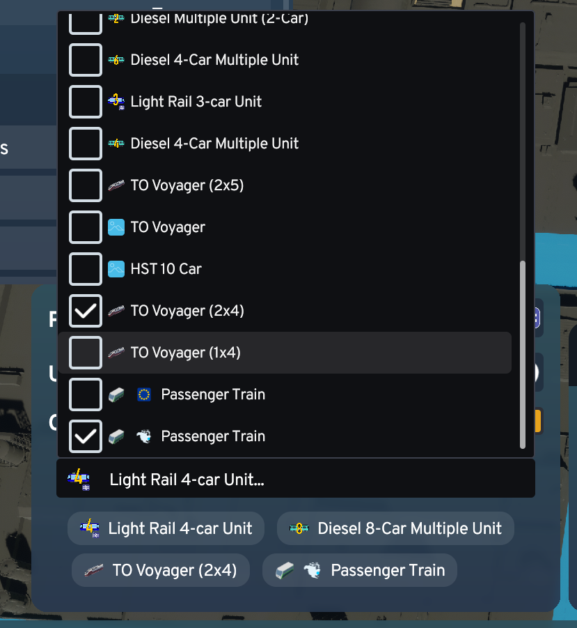

# Route Planning Extension

Choose route vehicles and randomize route colors while planning a route in Cities: Skylines II instead of letting the game always decide first.

Current behavior:

- Shows vehicle dropdowns directly in the route planning toolbox.
- Supports multi-select.
- Applies the chosen vehicles to the planned route and to the final created route.
- Saves selections per route prefab and restores them next time.
- Supports auto-random route colors with separate toggles per route family.
- Hides controls when a route only has zero or one usable option.
- Only shows `secondary` for cargo trains.

Screenshots:

